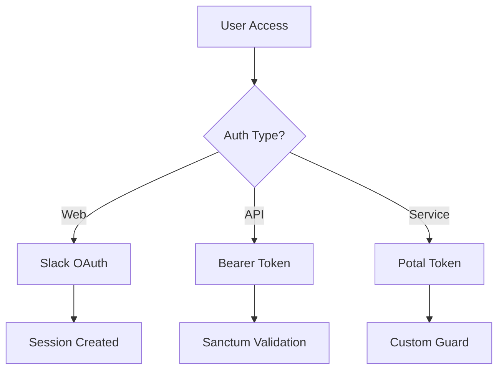

# GibPotato CakePHP to Laravel Migration Plan

## Executive Summary

This document outlines the comprehensive migration plan for transitioning the GibPotato application from CakePHP 5.2 to Laravel. GibPotato is a Slack bot application that implements a gamified reward system where users can give "potatoes" to each other as recognition.

## Table of Contents

1. [Application Overview](#1-application-overview)
2. [Database Migration](#2-database-migration)
3. [Model/Entity Migration](#3-modelentity-migration)
4. [Authentication Migration](#4-authentication-migration)
5. [Service Layer Migration](#5-service-layer-migration)
6. [Event System Migration](#6-event-system-migration)
7. [Command/Console Migration](#7-commandconsole-migration)
8. [API Routes Migration](#8-api-routes-migration)
9. [Frontend Integration](#9-frontend-integration)
10. [Infrastructure & Configuration](#10-infrastructure--configuration)
11. [Testing Migration](#11-testing-migration)
12. [Migration Steps & Timeline](#12-migration-steps--timeline)
13. [Key Considerations](#13-key-considerations)
14. [Risk Mitigation](#14-risk-mitigation)

## 1. Application Overview

### Purpose
Slack bot for a gamified reward system using "potatoes" as currency

### Architecture
- **Go service (potal)**: Handles Slack events and forwards them to PHP backend
- **CakePHP backend**: Handles business logic, data storage, and API
- **Vue.js 3 frontend**: SPA with Vite bundler

### Key Features
- Slack OAuth authentication
- Potato awarding system (messages and reactions)
- User progression/leveling
- Virtual shop for spending potatoes
- Polls and voting
- Quick wins/achievements
- Scheduled notifications and reports

## 2. Database Migration

### 2.1 Database Tables

The application uses the following main tables:

| Table | Purpose |
|-------|---------|
| `users` | Slack users with roles, status, notifications preferences |
| `messages` | Potato transactions between users |
| `products` | Shop items users can purchase |
| `purchases` | Purchase history |
| `polls` | User-created polls |
| `poll_options` | Options for polls |
| `poll_responses` | User responses to polls |
| `progression` | User levels/achievements |
| `quick_wins` | Achievement tracking |
| `api_tokens` | API authentication tokens |

### 2.2 Migration Strategy

1. **Create Laravel migration files** maintaining the same structure
2. **Convert UUID primary keys** (CakePHP uses UUIDs by default)
3. **Preserve all foreign key relationships**
4. **Maintain JSON columns** (notifications in users table)
5. **Keep existing indexes** for performance

### 2.3 Sample Migration

```php
// database/migrations/2024_01_01_000001_create_users_table.php
Schema::create('users', function (Blueprint $table) {
    $table->uuid('id')->primary();
    $table->foreignUuid('progression_id')->nullable();
    $table->string('status')->default('active');
    $table->string('role')->default('user');
    $table->string('slack_user_id')->unique();
    $table->string('slack_name');
    $table->string('slack_picture');
    $table->string('slack_time_zone')->nullable();
    $table->boolean('slack_is_bot')->default(false);
    $table->json('notifications')->nullable();
    $table->timestamps();
    
    $table->index('slack_user_id');
});
```

## 3. Model/Entity Migration

### 3.1 Eloquent Models Structure

```
app/Models/
├── User.php
├── Message.php  
├── Product.php
├── Purchase.php
├── Poll.php
├── PollOption.php
├── PollResponse.php
├── Progression.php
├── QuickWin.php
└── ApiToken.php
```

### 3.2 Key Relationships

```php
// User.php
class User extends Model
{
    public function messagesSent()
    {
        return $this->hasMany(Message::class, 'sender_user_id');
    }
    
    public function messagesReceived()
    {
        return $this->hasMany(Message::class, 'receiver_user_id');
    }
    
    public function progression()
    {
        return $this->belongsTo(Progression::class);
    }
    
    public function purchases()
    {
        return $this->hasMany(Purchase::class);
    }
    
    public function apiToken()
    {
        return $this->hasOne(ApiToken::class);
    }
}
```

### 3.3 Model Features to Implement

- UUID trait for all models
- Accessor/Mutator for notifications JSON
- Constants for statuses and roles
- Scope methods for common queries

## 4. Authentication Migration

### 4.1 Current Auth System

- **Web Authentication**: Slack OAuth for web users
- **API Authentication**: Token-based for services
- **Two Middleware Types**: 
  - `web-auth`: Session + API token
  - `service-auth`: API token only

### 4.2 Laravel Implementation

1. **Laravel Sanctum** for API tokens
2. **Custom Slack OAuth Provider** using Laravel Socialite
3. **Custom Guards** for service authentication
4. **Middleware Migration**:
   ```php
   // app/Http/Middleware/VerifyPotalToken.php
   // app/Http/Middleware/VerifySlackSignature.php
   ```

### 4.3 Authentication Flow



## 5. Service Layer Migration

### 5.1 Service Classes Structure

```
app/Services/
├── AwardService.php       # Core potato awarding logic
├── NotificationService.php # Slack/Discord notifications
├── PollService.php        # Poll management
├── ProgressionService.php # User leveling system
├── QuickWinService.php    # Achievement tracking
└── UserService.php        # User management
```

### 5.2 Service Registration

```php
// app/Providers/AppServiceProvider.php
public function register()
{
    $this->app->singleton(AwardService::class);
    $this->app->singleton(NotificationService::class);
    // ... other services
}
```

### 5.3 Key Service Methods

```php
// AwardService.php
class AwardService
{
    public function gib(User $fromUser, array $toUsers, Event $event): void
    {
        foreach ($toUsers as $toUser) {
            $this->gibToUser($fromUser, $toUser, $event);
        }
    }
}
```

## 6. Event System Migration

### 6.1 Event Types

| CakePHP Event | Laravel Event | Purpose |
|---------------|---------------|---------|
| MessageEvent | MessageReceived | Handle potato messages |
| DirectMessageEvent | DirectMessageReceived | Handle DMs to bot |
| ReactionAddedEvent | ReactionAdded | Handle potato reactions |
| AppMentionEvent | AppMentioned | Handle bot mentions |
| AppHomeOpenedEvent | AppHomeOpened | Handle app home views |
| SlashCommandEvent | SlashCommandReceived | Handle /commands |
| LinkSharedEvent | LinkShared | Handle URL unfurling |

### 6.2 Event Implementation

```php
// app/Events/Slack/MessageReceived.php
class MessageReceived
{
    public function __construct(
        public string $sender,
        public array $receivers,
        public int $amount,
        public string $channel,
        public string $text,
        public string $timestamp
    ) {}
}

// app/Listeners/ProcessPotatoMessage.php
class ProcessPotatoMessage
{
    public function handle(MessageReceived $event): void
    {
        // Process potato giving logic
    }
}
```

### 6.3 Event Factory Pattern

```php
// app/Factories/SlackEventFactory.php
class SlackEventFactory
{
    public static function create(array $payload): SlackEvent
    {
        return match($payload['type']) {
            'message' => new MessageReceived(...),
            'reaction_added' => new ReactionAdded(...),
            // ... other event types
        };
    }
}
```

## 7. Command/Console Migration

### 7.1 Artisan Commands

```
app/Console/Commands/
├── ProgressionCommand.php    # Update user progression
├── SendMessageCommand.php    # Send Slack messages
├── ShowAndTellCommand.php    # Weekly show & tell
├── TooGoodToGoCommand.php    # Food waste notifications
├── UpdateUsersCommand.php    # Sync Slack users
└── WeeklyReportCommand.php   # Weekly potato reports
```

### 7.2 Command Implementation

```php
// app/Console/Commands/WeeklyReportCommand.php
class WeeklyReportCommand extends Command
{
    protected $signature = 'potato:weekly-report';
    protected $description = 'Send weekly potato reports to users';
    
    public function handle(NotificationService $notifications): void
    {
        // Report generation logic
    }
}
```

### 7.3 Scheduling

```php
// app/Console/Kernel.php
protected function schedule(Schedule $schedule)
{
    $schedule->command('potato:weekly-report')->weeklyOn(1, '9:00');
    $schedule->command('potato:update-users')->hourly();
    $schedule->command('potato:progression')->daily();
}
```

## 8. API Routes Migration

### 8.1 Route Structure

Laravel routes are organized into three files for better separation of concerns:

#### Web Routes (`routes/web.php`)
```php
// Authentication Routes (Guest Only)
Route::middleware(['guest'])->group(function () {
    Route::get('/login', [SlackLoginController::class, 'login'])->name('login');
    Route::get('/login/mobile', [SlackLoginController::class, 'mobile'])->name('login.mobile');
    Route::get('/start-open-id/{workspace?}', [SlackLoginController::class, 'redirect'])->name('slack.redirect');
    Route::get('/open-id/{workspace?}', [SlackLoginController::class, 'callback'])->name('slack.callback');
});

// Authenticated SPA Routes
Route::middleware(['auth', 'verified'])->group(function () {
    Route::get('/', [HomeController::class, 'index'])->name('home');
    Route::get('/shop', [HomeController::class, 'index'])->name('shop');
    Route::get('/collection', [HomeController::class, 'index'])->name('collection');
    Route::get('/quick-wins', [HomeController::class, 'index'])->name('quick-wins');
    Route::get('/profile', [HomeController::class, 'index'])->name('profile');
    Route::get('/settings', [HomeController::class, 'index'])->name('settings');
});
```

#### API Routes (`routes/api.php`)
```php
Route::middleware(['auth:sanctum'])->group(function () {
    // Leaderboard
    Route::get('/leaderboard', [LeaderBoardController::class, 'index'])->name('api.leaderboard');
    
    // Users
    Route::get('/users', [UsersController::class, 'index'])->name('api.users.index');
    
    // Current User
    Route::prefix('user')->name('api.user.')->group(function () {
        Route::get('/', [UsersController::class, 'show'])->name('show');
        Route::patch('/', [UsersController::class, 'update'])->name('update');
        Route::get('/profile', [UsersController::class, 'profile'])->name('profile');
    });
    
    // Shop
    Route::prefix('shop')->name('api.shop.')->group(function () {
        Route::get('/products', [ShopController::class, 'products'])->name('products');
        Route::post('/purchase', [ShopController::class, 'purchase'])->name('purchase');
    });
    
    // Collection & Quick Wins
    Route::get('/collection', [CollectionController::class, 'index'])->name('api.collection');
    Route::get('/quick-wins', [QuickWinsController::class, 'index'])->name('api.quick-wins');
});
```

#### Service Routes (`routes/services.php`)
```php
// Slack Events (via potal service)
Route::middleware(['verify.potal'])->group(function () {
    Route::post('/events', [EventsController::class, 'handle'])->name('services.events.handle');
});

// Health check endpoint
Route::get('/health', function () {
    return response()->json(['status' => 'ok', 'timestamp' => now()->toIso8601String()]);
})->name('services.health');
```

### 8.2 Middleware Configuration

Register custom middleware in `app/Http/Kernel.php`:

```php
protected $middlewareAliases = [
    // ... existing middleware
    'verify.potal' => \App\Http\Middleware\VerifyPotalToken::class,
    'verify.slack' => \App\Http\Middleware\VerifySlackSignature::class,
];

protected $middlewareGroups = [
    'web' => [
        // ... existing middleware
        \App\Http\Middleware\EncryptCookies::class,
        \Illuminate\Session\Middleware\StartSession::class,
        \App\Http\Middleware\VerifyCsrfToken::class,
    ],
    
    'api' => [
        \Laravel\Sanctum\Http\Middleware\EnsureFrontendRequestsAreStateful::class,
        'throttle:api',
        \Illuminate\Routing\Middleware\SubstituteBindings::class,
    ],
];
```

### 8.3 Route Service Provider

Update `app/Providers/RouteServiceProvider.php` to register all route files:

```php
public function boot(): void
{
    $this->routes(function () {
        Route::middleware('api')
            ->prefix('api')
            ->group(base_path('routes/api.php'));

        Route::middleware('web')
            ->group(base_path('routes/web.php'));
        
        // Service routes for external integrations
        Route::middleware('api')
            ->group(base_path('routes/services.php'));
    });
}
```

### 8.4 API Response Format

```php
// app/Http/Resources/UserResource.php
class UserResource extends JsonResource
{
    public function toArray($request): array
    {
        return [
            'id' => $this->id,
            'slack_name' => $this->slack_name,
            'slack_picture' => $this->slack_picture,
            'balance' => $this->getBalance(),
            'level' => $this->progression->level,
        ];
    }
}
```

## 9. Frontend Integration

### 9.1 Required Updates

1. **API Endpoints**: Update all API calls to match Laravel routes
2. **Authentication**: Adjust for Laravel Sanctum tokens
3. **CSRF Handling**: Update for Laravel's CSRF protection
4. **Error Handling**: Adapt to Laravel's error response format

### 9.2 API Client Updates

```javascript
// frontend/src/api/index.js
const api = axios.create({
  baseURL: '/api',
  withCredentials: true,
  headers: {
    'X-Requested-With': 'XMLHttpRequest',
    'Accept': 'application/json',
  }
});

// Add Sanctum CSRF token handling
api.interceptors.request.use(config => {
  const token = document.head.querySelector('meta[name="csrf-token"]');
  if (token) {
    config.headers['X-CSRF-TOKEN'] = token.content;
  }
  return config;
});
```

## 10. Infrastructure & Configuration

### 10.1 Environment Variables

```env
# Application
APP_NAME=GibPotato
APP_ENV=production
APP_KEY=base64:...
APP_DEBUG=false
APP_URL=https://gib-potato.sentry.io

# Database
DB_CONNECTION=pgsql
DB_HOST=db.gib-potato.test
DB_PORT=5432
DB_DATABASE=gib_potato
DB_USERNAME=gib_potato
DB_PASSWORD=password

# Slack
SLACK_CLIENT_ID=
SLACK_CLIENT_SECRET=
SLACK_SIGNING_SECRET=
SLACK_TEAM_ID=
SLACK_BOT_USER_OAUTH_TOKEN=

# Discord
DISCORD_BOT_TOKEN=

# Sentry
SENTRY_LARAVEL_DSN=
SENTRY_FRONTEND_DSN=

# Services
POTAL_TOKEN=
POTAL_URL=http://potal:3000
POTATO_CHANNEL=#general
POTATO_SLACK_USER_ID=U12345
```

### 10.2 Docker Updates

```dockerfile
# docker/backend/Dockerfile
FROM php:8.4-apache

# Install Laravel dependencies
RUN apt-get update && apt-get install -y \
    git \
    curl \
    libpng-dev \
    libonig-dev \
    libxml2-dev \
    zip \
    unzip \
    libpq-dev

# Install PHP extensions
RUN docker-php-ext-install pdo_pgsql mbstring exif pcntl bcmath gd

# Configure Apache for Laravel
ENV APACHE_DOCUMENT_ROOT /var/www/gib-potato/public
RUN sed -ri -e 's!/var/www/html!${APACHE_DOCUMENT_ROOT}!g' /etc/apache2/sites-available/*.conf
RUN a2enmod rewrite
```

## 11. Testing Migration

### 11.1 Test Structure

```
tests/
├── Feature/
│   ├── Api/
│   │   ├── LeaderboardTest.php
│   │   ├── ShopTest.php
│   │   └── UsersTest.php
│   ├── Commands/
│   │   └── WeeklyReportTest.php
│   └── Events/
│       └── MessageEventTest.php
├── Unit/
│   ├── Models/
│   │   └── UserTest.php
│   └── Services/
│       └── AwardServiceTest.php
└── TestCase.php
```

### 11.2 Factory Migration

```php
// database/factories/UserFactory.php
class UserFactory extends Factory
{
    public function definition(): array
    {
        return [
            'id' => $this->faker->uuid(),
            'slack_user_id' => 'U' . $this->faker->randomNumber(8),
            'slack_name' => $this->faker->userName(),
            'slack_picture' => $this->faker->imageUrl(),
            'status' => 'active',
            'role' => 'user',
        ];
    }
}
```

## 12. Migration Steps & Timeline

### Phase 1: Setup (Week 1)
- [ ] Create new Laravel project structure
- [ ] Set up Docker environment for Laravel
- [ ] Create all database migrations
- [ ] Set up basic authentication framework
- [ ] Configure development environment

### Phase 2: Core Models & Services (Week 2-3)
- [ ] Create all Eloquent models with relationships
- [ ] Implement UUID support
- [ ] Migrate service classes
- [ ] Implement event system
- [ ] Create API endpoints
- [ ] Set up model factories and seeders

### Phase 3: Slack Integration (Week 4)
- [ ] Implement Slack OAuth with Socialite
- [ ] Create event handlers for all Slack events
- [ ] Test integration with potal service
- [ ] Implement notification system
- [ ] Set up Slack command handlers

### Phase 4: Frontend & Commands (Week 5)
- [ ] Update frontend API calls
- [ ] Migrate all console commands
- [ ] Set up scheduled tasks
- [ ] Implement remaining features
- [ ] Update authentication flow

### Phase 5: Testing & Deployment (Week 6)
- [ ] Comprehensive testing
- [ ] Performance optimization
- [ ] Sentry integration setup
- [ ] Production deployment preparation
- [ ] Documentation updates

## 13. Key Considerations

### 13.1 Technical Considerations

1. **UUID Primary Keys**: Implement UUID trait for all models
   ```php
   trait HasUuid
   {
       protected static function boot()
       {
           parent::boot();
           static::creating(function ($model) {
               $model->id = Str::uuid();
           });
       }
   }
   ```

2. **Middleware**: Create custom middleware for Slack signature verification
3. **Sentry Integration**: Use `sentry/sentry-laravel` package
4. **Background Jobs**: Implement Laravel queues for async operations
5. **Caching**: Use Redis for session and cache storage

### 13.2 Performance Optimizations

- Implement database query optimization
- Use eager loading for relationships
- Cache frequently accessed data
- Optimize asset compilation

### 13.3 Security Considerations

- Maintain Slack request signature verification
- Implement rate limiting
- Use Laravel's built-in security features
- Regular security audits

## 14. Risk Mitigation

### 14.1 Mitigation Strategies

1. **Parallel Running**: Run both systems in parallel during migration
2. **Feature Flags**: Implement feature flags to gradually switch to Laravel
3. **Backwards Compatibility**: Maintain compatibility for the potal service
4. **Comprehensive Logging**: Implement detailed logging for debugging
5. **Rollback Procedures**: Plan rollback for each migration phase

### 14.2 Testing Strategy

- Unit tests for all services
- Integration tests for Slack events
- End-to-end tests for critical flows
- Performance testing
- Security testing

### 14.3 Deployment Strategy

1. **Blue-Green Deployment**: Minimize downtime
2. **Database Migration**: Run migrations during low-traffic periods
3. **Monitoring**: Set up comprehensive monitoring
4. **Gradual Rollout**: Deploy to percentage of users first
5. **Rollback Plan**: Document and test rollback procedures

## Conclusion

This migration plan provides a structured approach to transitioning from CakePHP to Laravel while maintaining all functionality and minimizing disruption. The six-week timeline allows for thorough testing and gradual migration of components.

Key success factors:
- Maintaining feature parity
- Ensuring zero data loss
- Minimizing user disruption
- Improving performance and maintainability

Regular checkpoint meetings should be scheduled to assess progress and adjust the plan as needed.